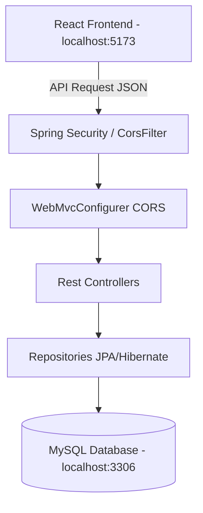
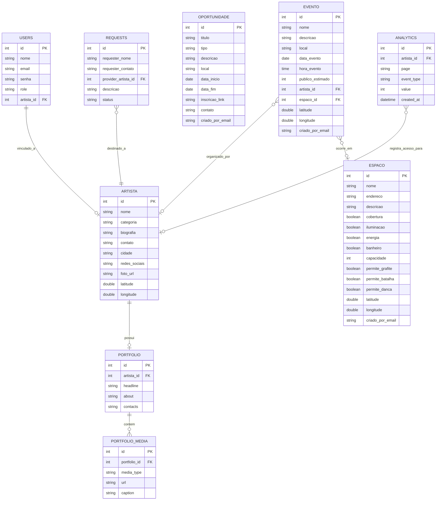

# OCUPA - Arquitetura e Guia do Projeto

Esta documentação descreve a arquitetura geral do ecossistema **OCUPA** (solução para redes de economia criativa periférica), especificando as responsabilidades de cada componente e fornecendo instruções detalhadas para inicialização em ambiente de desenvolvimento local.

---

## 1. Visão Geral da Solução

O **OCUPA** é um ecossistema projetado para mapear, conectar e monetizar a produção artística periférica. O projeto é estruturado em uma arquitetura de duas camadas desacopladas (Frontend e Backend) que se integram via APIs RESTful baseadas em JSON.

- **Backend (API REST)**: Desenvolvido em Java com Spring Boot, Spring Security e Spring Data JPA. Gerencia as regras de negócio, persistência no banco de dados relacional e controle de acesso.
- **Frontend (Interface Web)**: Desenvolvido em React + Vite utilizando TypeScript e componentes UI da biblioteca **Flowbite React** baseada em Tailwind CSS.
- **Mapeamento Afetivo**: Mapas dinâmicos alimentados pela biblioteca **Leaflet** renderizados inteiramente no lado do cliente.
- **Banco de Dados**: MySQL para persistência e armazenamento das tabelas relacionais de negócios e analytics.

---

## 2. Arquitetura Geral do Sistema

O fluxo de comunicação segue a arquitetura cliente-servidor padrão:



### 2.1 Backend (Java Spring Boot)
O backend é estruturado sob o padrão arquitetural MVC (focado em REST APIs) dividido nas seguintes camadas:
- **`com.ocupa.ocupa.model` (Entidades JPA)**: Classes que mapeiam as tabelas do banco de dados e definem relacionamentos bidirecionais (por exemplo, `@OneToMany` em `Portfolio` para `PortfolioMedia` com `@JsonIgnore` para prevenção de recursão infinita).
- **`com.ocupa.ocupa.repository` (Acesso a Dados)**: Interfaces que estendem `JpaRepository`, fornecendo consultas automáticas e personalizadas (ex: filtragem de propostas de orçamento por artista provedor).
- **`com.ocupa.ocupa.controller` (Endpoints REST)**: Controladores HTTP anotados com `@RestController` que expõem endpoints sob a rota raiz `/api`.
- **`com.ocupa.ocupa.config` (Configurações Globais)**:
  - `SecurityConfig.java`: Configuração de segurança de desenvolvimento (CSRF desabilitado, liberação de rotas REST).
  - `WebConfig.java`: Habilitação e especificação de CORS global (Cross-Origin Resource Sharing) com credenciais autorizadas (`allowCredentials(true)` e suporte a `allowedOriginPatterns("*")`) para o frontend.

### 2.2 Frontend (React + TypeScript + Flowbite)
O frontend adota uma abordagem de componente único com roteamento controlado por estado interno no React para navegação fluida de abas:
- **`App.tsx` (Núcleo da Aplicação)**: Gerencia o estado de sessão de usuário logado (armazenado no `localStorage`) e controla o rendering das páginas.
- **Páginas Principais**:
  - `LoginPage` / `RegisterPage`: Controle de autenticação integrado com a API.
  - `ArtistasPage`: Dashboard público de busca de talentos por filtros dinâmicos, formulário de contato de contratação e gatilho de estatísticas.
  - `PainelPage`: Painel exclusivo para o artista logado ver suas métricas de analytics (visualizações de perfil, cliques em contatos), atualizar seu portfólio rico (headline, biografia, galeria de imagens/mídias) e gerenciar propostas de orçamentos recebidas.
  - `EspacosPage`: Listagem de espaços, mapa georreferenciado interativo e formulário de mapeamento com seleção automática de coordenadas ao clicar no mapa.
  - `EventosPage`: Agenda cultural de apresentações ordenadas por data de realização.
  - `OportunidadesPage`: Vagas e editais culturais categorizados.

---

## 3. Modelo do Banco de Dados

Diagrama de Entidade-Relacionamento (ER) do banco de dados relacional `ocupa_db`:



---

## 4. Controle de Acesso e Regras de Negócio

Para promover a segurança do ecossistema e assegurar a governança dos dados, foram estabelecidas as seguintes regras no frontend integradas ao payload enviado ao backend:

1. **Modo Somente Leitura (Visitante)**: Usuários que não efetuaram login podem navegar livremente pelo ecossistema, ver artistas, editais, eventos e espaços mapeados, mas não veem opções para criar novos registros ou editá-los.
2. **Criação de Ativos**: É obrigatório estar logado para cadastrar novos Espaços, criar Eventos na Agenda ou publicar novas Oportunidades. Ao salvar, a aplicação vincula automaticamente o e-mail do autor ao atributo `criadoPorEmail`.
3. **Edição e Exclusão Restrita**: As ações de Editar e Excluir sobre Espaços, Eventos e Oportunidades são liberadas exclusivamente para:
   - Contas administradoras (`role === 'ADMIN'`).
   - O proprietário que criou o registro correspondente (onde `user.email === item.criadoPorEmail`).

---

## 5. Como Iniciar o Projeto Localmente

### 5.1 Pré-requisitos
Certifique-se de ter instalado em sua máquina:
- **Java JDK 17** ou superior.
- **Node.js** (versão 18 ou superior) com o gerenciador **npm**.
- **MySQL Server** ativo localmente (porta padrão `3306`).
- Criar o banco de dados vazio utilizando seu cliente SQL de preferência:
  ```sql
  CREATE DATABASE ocupa_db;
  ```

---

### 5.2 Executando o Backend (Java Spring Boot)
1. Navegue até a pasta do backend:
   ```bash
   cd ocupa-backend
   ```
2. Configure as credenciais de acesso ao seu MySQL local no arquivo [application.properties](file:///c:/Users/bruna/Desktop/Projeto Final - Bruna/ocupa-backend/src/main/resources/application.properties) (substituindo o nome do usuário e senha do banco conforme necessário).
3. Execute o comando Maven para baixar as dependências e iniciar o servidor de desenvolvimento:
   * **Windows**:
     ```powershell
     .\mvnw.cmd spring-boot:run
     ```
   * **Linux/macOS**:
     ```bash
     ./mvnw spring-boot:run
     ```
4. A API estará ativa em `http://localhost:8080/`.
5. **Dica**: No primeiro boot, o backend irá inserir automaticamente as seguintes contas de administrador padrão no banco de dados para testes imediatos:
   - **Email**: `admin@admin.com` (e também `admi@admin.com`)
   - **Senha**: `admin`

---

### 5.3 Executando o Frontend (Vite/React)
1. Navegue até a pasta do frontend:
   ```bash
   cd ocupa-frontend
   ```
2. Instale os pacotes e dependências necessárias do projeto:
   ```bash
   npm install
   ```
3. Inicie o servidor de desenvolvimento do Vite:
   ```bash
   npm run dev
   ```
4. A interface web estará acessível no seu navegador no endereço: **`http://localhost:5173/`**.
